<!-- AOC TILES BEGIN -->
<h1 align="center">
  2024 - 24 ⭐ - OCaml
</h1>
<a href="src/day1/part1.ml">
  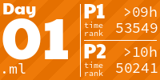
</a>
<a href="src/day2/part1.ml">
  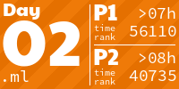
</a>
<a href="src/day3/part1.ml">
  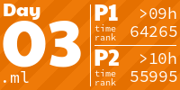
</a>
<a href="src/day4/part1.ml">
  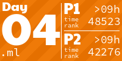
</a>
<a href="src/day5/part1.ml">
  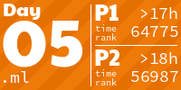
</a>
<a href="src/day6/part1.ml">
  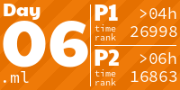
</a>
<a href="src/day7/part1.ml">
  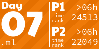
</a>

<a href="src/day9/part1.ml">
  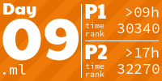
</a>
<a href="src/day10/part1.ml">
  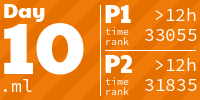
</a>
<a href="src/day11/part1.ml">
  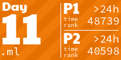
</a>

<a href="src/day13/part1.ml">
  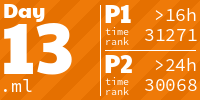
</a>
<!-- AOC TILES END -->